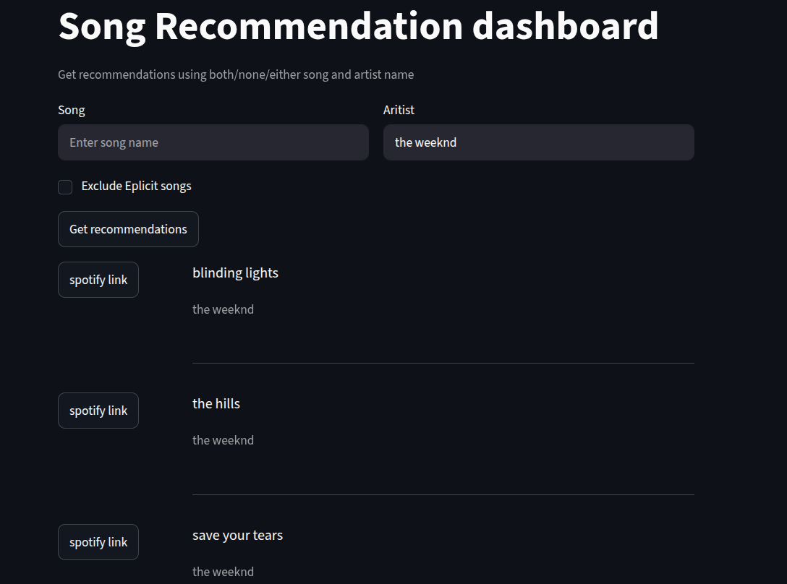

# Overview

A content based song recommendation system which recommends song based on provided song and/or artist name.  

## Dataset overview  

acoustic characteristics (danceability, energy, valence, tempo, etc.),  
semantic metadata (artists, genres, album name ).  

## Dataset link: 
https://www.kaggle.com/datasets/maharshipandya/-spotify-tracks-dataset  

## Feature Representation  

Each song is represented as a hybrid feature vector:

**Song Vector** =
[
Scaled Audio Features
+
Sentence Embedding
]

**where**  

- Audio features capture acoustic properties.  
- Sentence embeddings encode semantic relationships between artists and genres.  

The final vectors are L2-normalized, for the dot product to be used as cosine similarity.  

# Recommendation pipeline  
query song   
    │  
     
Create song and artist boolean series  
    │  
     
Find matching song(s)  
    │  
construct the query vector  
    |  

Cosine similarity with feature the matrix    
     │   
     
Rank songs by similarity score  
     │  
    
Return Top-5 recommended songs  

## Demo 

  
##  Installation  on linux/macOS  

Clone the repo  
```bash
git clone https://github.com/vaebhav10/Song_recommendation.git
cd Song_recommendation
```

* create a virtual environment  
```bash
python3 -m venv .venv  
source .venv/bin/activate  
```

Install dependencies:  
```bash
pip install -r requirements.txt
```

* Execute the `preprocess.py` file once to generate the embeddings.  

* excute the `app.py` file for streamlit dashboard:  
    ``` bash 
    streamlit run app.py
    ```
